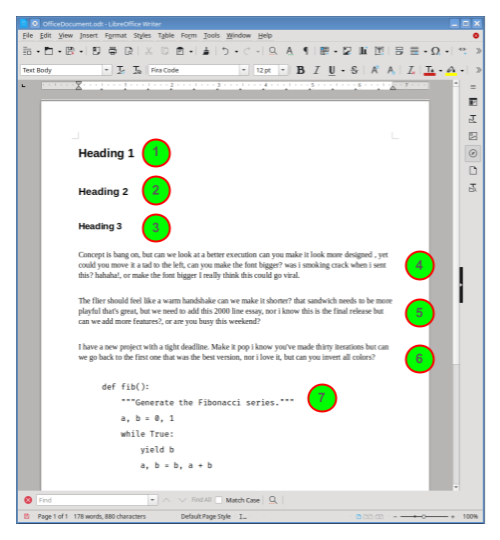
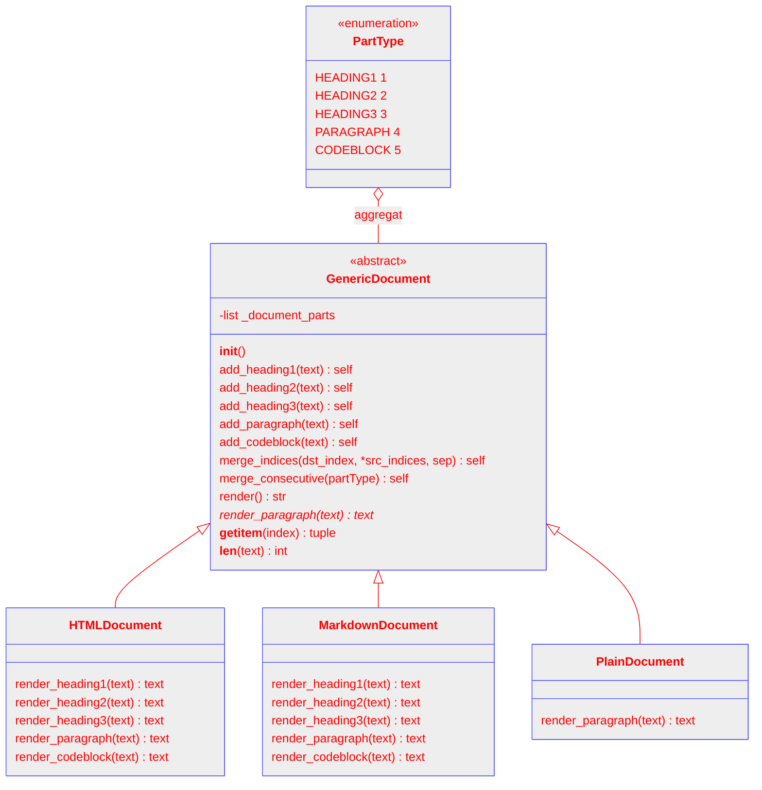

# Uppgift 12 - Skapa dokument i olika format

# Syfte

Syftet med denna uppgift är flerfaldigt:

- Ge en djupare förståelse för objektorienterad programmering (OOP) genom att
  utforska koncept som klasser, arv, abstrakta klasser, abstrakta metoder och
  klassmetoder.
- Utveckla förmågan att använda getattr för att kontrollera attribut och metoder
  hos objekt, vilket är viktigt för att skapa dynamisk och flexibel kod.
- Förbättra förmågan att noggrant följa och implementera en uppgift baserad på
  en detaljerad och omfattande beskrivning, vilket förbereder för komplexa
  programmeringsprojekt och förbättrar läsförståelsen för teknisk dokumentation.

# Inför uppgiften

- Mental förberedelse. Även om detta är en av de större uppgifterna i mängden
  text i beskrivningen och i antal filer, så är det inte nödvändigtvis den
  svåraste. Tänk positivt och var tålmodig. Ta det steg för steg och dela upp
  arbetet i hanterbara delar.
- Lär dig hur virtuella miljöer fungerar och hur de används för
  projektberoenden.
- Läs igenom dokumentationen för pytest.
- Läs den korta artikeln [Test Driven Development][3] av Martin Fowler då TDD är
  ett rekommenderat sätt att arbeta med uppgiften.
- Läs på om hur klasser, arv, abstrakta klasser, abstrakta metoder och
  klassmetoder fungerar i Python.


# Beskrivning

## Övergripande

Vi inleder med att först övergripande beskriva den tänkta lösningens delar,
senare dyker vi ned i detaljer för varje del.

### Den abstrakta överklassen `GenericDocument`

Skapa en abstrakt överklass med namnet `GenericDocument` som representerar ett
generellt dokument.

Ett sätt att beskriva ett dokument är i den ordning som vi läser texten. För
svenska dokument så läser vi från vänster till höger och uppifrån och ned.

Om vi beskriver ett dokument på det sättet, så finns det både en given ordning
att räkna upp dokumentets delar samt ett sätt att hitta en given del genom att
säga dess nummer i den ordningen.

Det säger oss att vi kan representera dokumentet som något itererbart, och
eftersom vi kan peka ut en viss del med dess index så går det att använda en
sekvens (allt itererbart är inte sekvenser).

En förenklad modell för ett dokument är att strunta i "vänster till höger"-delen
av det och bestämma att en sorts del måste vara ensam och att delarna beskrivs
uppifrån och ned. I en sådan modell kan vi inte representera fetstil inom
texten eller annat som sker inom texten men den räcker gott i vårt fall.



I exemplet ovan med ordbehandlingsprogrammet LibreOffice Writer så finns
dokumentets delar utmarkerade. Exemplet har sju delar och delarna består av
totalt fem olika typer.

| Nr  | Typ         | Text (bryts vid ...)                           |
| --- | ----------- | ---------------------------------------------- |
| 1   | `HEADING1`  | Heading 1                                      |
| 2   | `HEADING2`  | Heading 2                                      |
| 3   | `HEADING3`  | Heading 3                                      |
| 4   | `PARAGRAPH` | Concept is bang on, but can we look at a...    |
| 5   | `PARAGRAPH` | The flier should feel like a warm handshake... |
| 6   | `PARAGRAPH` | I have a new project with a tight deadline...  |
| 7   | `CODEBLOCK` | def fib():\\n a, b = 0, 1\\n...                |

`GenericDocument` kan lagra och manipulera ett generellt dokument enligt
ovanstående modell men den kan inte skapa ett konkret dokument i något specifikt
format. Det vet med andra ord inget om filformat som HTML eller Markdown.

### `PartType` beskriver en dokumentdels typ

Varje del i dokumentet som `GenericType` modellerar är av en viss typ och har en
tillhörande text.

Vi skulle kunna representera typen med en siffra eller en sträng, men det blir
mer läsbart och lättare att underhålla med en "enumeration". Skapa en `Enum` som
heter `PartType` och har nyckel-värdepar enligt följande tabell:

| Nyckel    | Värde |
| --------- | ----- |
| HEADING1  | 1     |
| HEADING2  | 2     |
| HEADING3  | 3     |
| PARAGRAPH | 4     |
| CODEBLOCK | 5     |

Det är bara dessa fem sorters dokumentdelar som vi behöver ha stödja.

### Konkreta underklasser som skapar faktiska dokument

Klassen `GenericDocument` hanterar dokument på en abstrakt nivå, utan att
bestämma sig för vilket format som dokumentet faktiskt ska ha för att kunna
läsas av en människa.

För att stödja riktiga dokumentformat så ska vi i vår lösning skapa en ny klass
för varje format som vi vill stödja. Varje sådan klass ska ärva från
`GenericDocument` och innehålla den kod som krävs för att exportera det formatet
som klassen är till för.

Vi vill att överklassen `GenericDocument` ska hjälpa till med så mycket som
möjligt utan att för den sakens skull veta något om konkreta dokumentformat.

Det betyder att den kan erbjuda möjlighet att lägga till dokumentets delar som
rubriker (headings), stycken (paragraph) och kodblock (codeblock) samt att
manipulera dessa. Skiljelinjen går vid gränsen där vetskap om formatet behövs,
att exportera till HTML eller Markdown är den konkreta underklassens jobb.

I vår lösning ska vi stödja tre format i följande klasser: `HTMLDocument`,
`MarkdownDocument` och `PlainDocument`. Skillnaden mellan "Markdown" och "Plain"
är att den senare resulterar i enklast möjliga dokument där varje del separeras
med en tom rad utan något speciellt som indikerar rubrik eller liknande.

Alla underklasser till `GenericDocument` **måste** som minst implementera
metoden `render_paragraph(text): text`. Den metoden anropar överklassen för att
omvandla stycken (paragraph) till det format som klassen representerar.

Underklasserna kan också implementera följande metoder som anropas för att
omvandla motsvarande del till klassens format:

- `render_heading1(text): text`
- `render_heading2(text): text`
- `render_heading3(text): text`
- `render_codeblock(text): text`

Det är överklassen `GenericDocument` som anropar ovanstående metoder i
underklassen och bygger upp ett totalt resultat som returneras från dess
`render()`-metod.

Det finns en prioriterad ordning för anrop till dessa metoder som vi går in på
senare. Vad det betyder är att om en metod saknas så testar överklassen en annan
metod istället. Som minst måste `render_paragraph(text): text` implementeras då
den är metoden som alla dokumentdelars typer till sist "faller tillbaka på".

### Klassdiagram

Den här delen innehåller en översikt över den önskade lösningens klasser
beskrivet med Unified Modeling Language (UML). Det kan vara bra att förtydliga
betydelsen av några saker innan vi tittar på diagrammet:

1. `<<enumeration>>` betyder att det är en [Enum][1].

2. `aggregat` betyder att instanser av klassen på den oifyllda diamantens sida,
   lagras i instanser av klassen på sidan med en vanlig linje. I vårt fall
   betyder det att instanser av vår enum `PartType` lagras i instanser av
   `GenericDocument`. Det är så eftersom sådana instanser ingår i det som lagras
   i `_document_parts`.

3. `<<abstract>>` betyder att en klass inte är tänkt att instansieras och
   användas direkt. Istället är det meningen att andra klasser ska ärva från den
   och implementera de abstrakta metoder som den innehåller. Sådana underklasser
   kallas därför för konkreta, eftersom de är redo att används och inte
   innehåller något vagt.

4. Om en metods namn är skriven med _kursiv text_ så betyder det att metoden är
   abstrakt. Det finns bara sådana metoder i abstrakta klasser. Det behövs ett
   sätt att markera sådana metoder i diagram eftersom abstrakta klasser **oftast
   innehåller en blanding** av konkreta och abstrakta metoder.

5. Linjer med en ihålig pil betyder att det finns en "arvsrelation". I vårt
   fall så betyder det helt enkelt att `HTMLDocument`, `MarkdownDocument` och
   `PlainDocument` alla underklasser till `GenericDocument`.



### Förväntade namn

Då det är många filer och ännu fler namn att hålla reda så på finns de
sammanfattade i nedanstående tabell.

<table>
    <thead>
        <tr>
            <th>Filnamn</th>
            <th>Namn i filen</th>
            <th>Typ</th>
            <th>Kommentar</th>
        </tr>
    </thead>
    <tbody>
        <tr>
            <td><code>GenericDocument.py</code></td>
            <td><code>GenericDocument</code></td>
            <td>Klass</td>
            <td>Abstrakt överklass</td>
        </tr>
        <tr>
            <td><code>PartType.py</code></td>
            <td><code>PartType</code></td>
            <td><code>enum.Enum</code></td>
            <td>Indikerar typ av dokumentdel</td>
        </tr>
        <tr>
            <td><code>HTMLDocument.py</code></td>
            <td><code>HTMLDocument</code></td>
            <td><code>GenericDocument</code></td>
            <td>Konkret klass som ärver från <code>GenericDocument</code></td>
        </tr>
        <tr>
            <td><code>test_HTMLDocument.py</code></td>
            <td>pytest-funktioner med namn i formatet: test_F_A</td>
            <td>Testfunktioner skrivna för att köras med pytest</td>
            <td>Minst fem tester</td>
        </tr>
        <tr>
            <td><code>MarkdownDocument.py</code></td>
            <td><code>MarkdownDocument</code></td>
            <td><code>GenericDocument</code></td>
            <td>Konkret klass som ärver från <code>GenericDocument</code></td>
        </tr>
        <tr>
            <td><code>test_MarkdownDocument.py</code></td>
            <td>pytest-funktioner med namn i formatet: test_F_A</td>
            <td>Testfunktioner skrivna för att köras med
            <code>pytest</code></td>
            <td>Minst fem tester</td>
        </tr>
        <tr>
            <td><code>PlainDocument.py<<code></td>
            <td><code>PlainDocument</code></td>
            <td><code>GenericDocument</code></td>
            <td>Konkret klass som ärver från <code>GenericDocument</code></td>
        </tr>
        <tr>
            <td><code>test_PlainDocument.py</code></td>
            <td>pytest-funktioner med namn i formatet: test_F_A</td>
            <td>Testfunktioner skrivna för att köras med pytest</td>
            <td>Minst fem tester</td>
        </tr>
        <tr>
            <td><code>requirements.txt</code></td>
            <td></td>
            <td>Fil med beroenden som kan installeras via
            <code>pip install -r requirements.txt</code></td>
            <td>Använd en virtuell miljö när du utvecklar.
            <code>pytest</code> behöver installeras.</td>
        </tr>
    </tbody>
</table>

Formatet på testernas namn (som är funktioner då vi ska använda `pytest`) är
`test_F_A`:

- `test` måste alla testers namn börja med.
- `F` är namnet på det som testas. Det kan vara funktionen eller metoden som
  testas.
- `A` är de argument som skickas med skrivet med vanlig text.

Testfunktionernas exakta namn är inte så noga, det är däremot viktigt att man
har en bra struktur på sina testnamn så att man enkelt förstår vad som testas.

## Enumen `PartType`

Beskrivs tidigare i dokumentet.

## Klassen `GenericDocument`

Överklass som dels lagrar ett dokuments generella dokumentdelar och har metoder
för att lägga till dokumentdelar (med `add_...`-metoderna) samt ändra dem (med
de två metoderna `merge_indices` och `merge_consecutive`).

Klassen har dessutom metoden `render(): -> text` vilken i sin tur ska anropa
metoder i underklasserna för att rendera ett dokument i ett konkret format. Med
andra ord så anropar den metoden i sin tur metoder som inte finns i den egna
klassen.

Det här dokumentet antar att dokumentdelarna lagras i instansvariabeln
`_document_parts` vilken har typen `[(PartType, str), ...]`. Du är fri att lagra
delarna i valfri variabel på valfritt sätt, så länge som det lagras i
överklassen och så länge som du använder din enum `PartType` för att indikera
vilken sorts del det är.

### Konstruktor

Konstruktorn skapar en ny tom lista för dokumentets delar. Den tar inga
argument.

- Konstruktorns signatur: `__init__() -> None`
- Utskrift: Inget
- Returvärde: Inget

### Metoder för att hämta element och skriva ut längden

Abstrakta klasser som ärver av ABC måste implementera __getitem__ och __len__
antingen i den abstrakta klassen eller den konkreta. Det är enklast att
implementera båda i den här klassen enligt följande kod:

```python
    def __getitem__(self, index):
        return self._document_parts[index]

    def __len__(self):
        return len(self._document_parts)
```

### Metoderna `add_heading[1..3]`, `add_paragraph` och `add_codeblock`

`add`-metoderna tar emot en text och lägger in en ny dokumentdel av den typ som
metodens namn indikerar.

För att identifiera typen så ska din enum `PartType` användas. Dessa metoder har
ett "fluent api" och ska därför returnera `self`.

Följande beskrivning för `add_heading1` fungerar på motsvarande sätt för de
övriga fem metoderna.

- Signatur: `add_heading1(text: str) -> None`
- Sidoeffekt: Tupeln `(PartType.HEADING1, text)` lägg tills sist i
  `_document_parts`
- Utskrift: Inget!
- Returvärde: `self`

#### Exempel

1. Anrop: `add_heading1("Fibonacci")`

   - Utskrift: Inget!
   - Sidoeffekt: Tupeln `(PartType.HEADING1, "Fibonacci")` lägg tills sist i
     `_document_parts`
   - Returvärde: `self`

2. Anrop: `add_codeblock("def fib():\n    a, b = 0, 1\n    while True:\n        yield b\n        a, b = b, a + b\n")`

   - Utskrift: Inget!
   - Sidoeffekt: Tupeln `(PartType.CODEBLOCK, "def fib():\n    a, b = 0, 1\n    while True:\n        yield b\n        a, b = b, a + b\n")`
     lägg tills sist i `_document_parts`
   - Returvärde: `self`

3. "Fluent"-anrop: `add_heading2("Underrubrik").add_codeblock("x = x + 1")`

   - Utskrift: Inget!
   - Sidoeffekt: Tuplarna `(PartType.HEADING2, "Underrubrik")` och
     `(PartType.CODEBLOCK, "x = x + 1")` läggs till sist i `_document_parts`
   - Returvärde: `self`

### Metoden `merge_indices`

Metoden `merge_indices` används för att "sammanfoga" text i dokumentdelarna vars
index finns i `src_indices` till texten i dokumentdelen vars index finns angivet
i `dst_index`. Mellan varje textdel finns en `sep`arator vilken är `\n` om inget
annat anges.

Efter textöverföringen tas dokumentdelarna angivna i `src_indices` bort.
Dokumentdelen i destinationen behåller sin typ och får bara mer text.

Oavsett ordningen som indexen i `src_indices` angetts så görs sammanfogningen
från lägst till högst index. Om `src_indices` innehåller dubletter tas dessa
bort.

Om `dst_index` angetts i `src_indices` kastas ett `ValueError`.

- Signatur: `merge_indices(dst_index: int, *src_indices, sep = "\n") -> Self`
- Sidoeffekt: Dokumentdelarna på källindexen (`src_indices`) raderas efter att
  deras text lagts till målindexets (`dst_index`) dokumentdels text, med en
  separator (`sep`) mellan textdelarna i ordningen lägst till högst index.
- Utskrift: Inget!
- Returvärde: `self`

#### Exempel

I följande exempel så antar vi, om inget annat anges, att det finns en instans
`h` med dokumentdelar enligt:

```python
h._document_parts = [
    (PartType.HEADING1, "Rubrik"),
    (PartType.PARAGRAPH, "Stycke ett."),
    (PartType.PARAGRAPH, "Stycke två."),
    (PartType.PARAGRAPH, "Stycke tre.")
]
```

1. Anrop: `h.merge_indices(1,2)`
   - Utskrift: Inget!
   - Sidoeffekt: Uppdaterad `_document_parts` enligt:

```python
h._document_parts = [
    (PartType.HEADING1, "Rubrik"),
    (PartType.PARAGRAPH, "Stycke ett.\nStycke två."),
    (PartType.PARAGRAPH, "Stycke tre.")
]
```

- Returvärde: `self`

2. Anrop: `h.merge_indices(0,1)`
   - Utskrift: Inget!
   - Sidoeffekt: Uppdaterad `_document_parts` enligt:

```python
h._document_parts = [
    (PartType.HEADING1, "Rubrik\nStycke ett."),
    (PartType.PARAGRAPH, "Stycke två."),
    (PartType.PARAGRAPH, "Stycke tre.")
]
```

- Returvärde: `self`

3. Anrop: `h.merge_indices(0,1,2,3)`
   - Utskrift: Inget!
   - Sidoeffekt: Uppdaterad `_document_parts` enligt:

```python
h._document_parts = [
    (PartType.HEADING1, "Rubrik\nStycke ett.\nStycke två.\nStycke tre.")
]
```

- Returvärde: `self`

4. Anrop: `h.merge_indices(0,2,3,1)`
   - Utskrift: Inget!
   - Sidoeffekt: Uppdaterad `_document_parts` enligt:

```python
h._document_parts = [
    (PartType.HEADING1, "Rubrik\nStycke ett.\nStycke två.\nStycke tre.")
]
```

- Returvärde: `self`

5. Anrop: `h.merge_indices(0,1,2,3,sep="<MYSEPARATOR>")`
   - Utskrift: Inget!
   - Sidoeffekt: Uppdaterad `_document_parts` enligt:

```python
h._document_parts = [
    (PartType.HEADING1, "Rubrik<MYSEPARATOR>Stycke ett.<MYSEPARATOR>Stycke två.<MYSEPARATOR>Stycke tre.")
]
```

- Returvärde: `self`

6. Anrop: `h.merge_indices(1,1,2)`
   - Undantag kastas!
   - Undantagstyp: `ValueError`


### Metoden `merge_consecutive`

`merge_consecutive` tar en `PartType` och sammanfogar intilliggande
dokumentdelar av typen `PartType`. Den första delen i varje grupp behålls och
texten från de följande delarna läggs till den, separerade med `"\n"` eller en
vald separator `sep`. Efter sammanfogning tas de överflödiga delarna bort. Denna
metod förenklar dokumentet genom att reducera upprepade dokumentdelar till en
enhetlig del.

- Signatur: `merge_consecutive(partType: PartType, sep: str = "\n") -> self`
- Sidoeffekt: Det finns inga repeterande dokumentdelar av typen `partType`
  eftersom de sammanfogats så att deras textinnehåll är i den första med en
  separator (`sep`) mellan textdelarna.
- Utskrift: Inget!
- Returvärde: `self`

#### Exempel

I följande exempel så antar vi, om inget annat anges, att det finns en instans
`h` med dokumentdelar enligt:

```python
h._document_parts = [
    (PartType.HEADING1, "Rubrik"),
    (PartType.PARAGRAPH, "Stycke ett."),
    (PartType.PARAGRAPH, "Stycke två."),
    (PartType.PARAGRAPH, "Stycke tre."),
]
```

1. Anrop: `h.merge_consecutive(PartType.PARAGRAPH)`
   - Utskrift: Inget!
   - Sidoeffekt: Uppdaterad `_document_parts` enligt:

```python
h._document_parts = [
    (PartType.HEADING1, "Rubrik"),
    (PartType.PARAGRAPH, "Stycke ett.\nStycke två.\nStycke tre."),
]
```

- Returvärde: `self`

2. Andra förutsättningar:

```python
h._document_parts = [
    (PartType.HEADING1, "Rubrik"),
    (PartType.PARAGRAPH, "Stycke ett."),
    (PartType.HEADING2, "Underrubrik"),
    (PartType.PARAGRAPH, "Stycke två."),
    (PartType.PARAGRAPH, "Stycke tre."),
]
```

- Anrop: `h.merge_consecutive(PartType.PARAGRAPH)`
- Utskrift: Inget!
- Sidoeffekt: Uppdaterad `_document_parts` enligt:

```python
h._document_parts = [
    (PartType.HEADING1, "Rubrik"),
    (PartType.PARAGRAPH, "Stycke ett."),
    (PartType.HEADING2, "Underrubrik"),
    (PartType.PARAGRAPH, "Stycke två.\nStycke tre."),
]
```

- Returvärde: `self`

3. Anrop: `h.merge_consecutive(PartType.CODEBLOCK)`

   - Utskrift: Inget!
   - Sidoeffekt: Ingen eftersom dokumentet inte ens innehöll ett `CODEBLOCK`
   - Returvärde: `self`

4. Anrop: `h.merge_consecutive(PartType.PARAGRAPH)`

   - Utskrift: Inget!
   - Sidoeffekt: Ingen eftersom dokumentet inte innehöll några intilligande
     dubletter av `HEADING1`
   - Returvärde: `self`

5. - Anrop: `h.merge_consecutive(PartType.PARAGRAPH, sep="<MYSEPARATOR>")`
   - Utskrift: Inget!
   - Sidoeffekt: Uppdaterad `_document_parts` enligt:

```python
h._document_parts = [
    (PartType.HEADING1, "Rubrik"),
    (PartType.PARAGRAPH, "Stycke ett.<MYSEPARATOR>Stycke två.<MYSEPARATOR>Stycke tre."),
]
```

- Returvärde: `self`

### Metoden `render`

Metoden `render() -> text` anropar renderingsmetoder i underklassen för att
skapa ett konkret dokument. Den enda metod som med säkerhet finns i
underklasserna är `render_paragraph(text) -> text`. I övrigt skall metoden
fungera enligt följande:

1. Börja med att skapa en tom sträng i en variabel enligt `result = ""`
2. Gå därefter igenom dokumentets delar i en for-loop och
   1. Anropa den metod som har högst prioritet enligt tabellen nedan för
      dokumentdelens typ. Om ingen prioriterad metod finns så ska
      `render_paragraph` anropas. Rendermetoden returnerar en sträng som
      motsvarar delen i ett konkret format. Låt oss kalla returnerade svaret
      `part_result`.
   2. Uppdatera `result` så att det innehåller det tidigare resultatet med
      `part_result` tillagt sist enligt `result = result + part_result`.
3. Efter for-loopen så avslutas funktionen genom att returnera `result`

| Typ                  | Prio #1            | Prio #2           | Prio #3           | Fallback            |
| -------------------- | ------------------ | ----------------- | ----------------- | ------------------- |
| `PartType.HEADING1`  | `render_heading1`  |                   |                   | `render_paragraph`  |
| `PartType.HEADING2`  | `render_heading2`  | `render_heading1` |                   | `render_paragraph`  |
| `PartType.HEADING3`  | `render_heading3`  | `render_heading2` | `render_heading1` | `render_paragraph`  |
| `PartType.PARAGRAPH` | `render_paragraph` |                   |                   | (`raise Exception`) |
| `PartType.CODEBLOCK` | `render_codeblock` |                   |                   | `render_paragraph`  |

Använd först `hasattr` för att kontrollera om en underklass innehåller en
specifik metod. Om så är fallet, använd sedan `getattr` för att dynamiskt anropa
denna metod.

- Signatur: `render() -> str`
- Utskrift: Inget!
- Returvärde: `str`

#### Exempel

Se underklasserna som implementerar metoderna som denna metod anropar.

### Den abstrakta metoden `render_paragraph`

Använd [`abc.abstractmethod`][2] för att markera metoden som abstrakt. När du
gjort det så kommer vi bara att kunna instansiera underklasser till
`GenericDocument` som implementerar metoden.

- "Annottation": `@abstractmethod`
- Signatur: `render_paragraph(text) -> str`
- Utskrift: Inget!
- Returvärde: `str`

#### Exempel

Se underklasserna som implementerar metoden.

### Tips

- Innan du börjar, läs igenom hela uppgiftsbeskrivningen för att förstå vad som
  förväntas och planera ditt arbete.
- Använd [Test-Driven Development][3] (TDD) och följ "Red-Green-Refactor"-flödet.
  Detta ger en strukturerad utvecklingsprocess och hjälper dig att upprätthålla
  hög kodkvalitet. Genom - att arbeta enligt TDD får du "på köpet" de minst fem
  tester per konkret underklass som uppgiften kräver.
- Börja utveckla `GenericDocument` och `PartType` först. Dessa utgör
  grundstenarna i din uppgiftslösning.
- Introducera `PlainDocument`, `HTMLDocument`, och `MarkdownDocument` i din
  utvecklingsprocess så snart du kan för att se hur allt fungerar tillsammans.
- Gör regelbundna commits och sträva efter att skriva klara och koncisa
  commit-meddelanden.

### Exempel

Se underklasserna som ärver från `GenericDocument` för exempel på hur en klass
av typen `GenericDocument` kan användass.

## Underklassen `PlainDocument`

Renderar dokumentet som så enkel text som möjligt. Det är enklare än Markdown då
vi inte indikerar typ av del alls för ett `PlainDocument`. Det enda som görs är
att vi har en tom rad mellan varje del.

### Konstruktor

Ingen.

### Metoden `render_paragraph`

Det är den enda metod som behövs i den här klassen då delens typ inte spelar
någon roll i kombination med att överklassen faller tillbaka på att anropa
`render_paragraph` om ingen prioriterad metod hittas.

Vad den ska göra.

- Signatur: `render_paragraph(text) -> str`
- Utskrift: Inget!
- Returvärde: Texten i `text` med två radmatningar (`"\n\n"`) tillagda på slutet
  för att generera en tom rad mellan varje dokumentdel.

#### Exempel

1. Anrop: `render_paragraph("")`

   - Utskrift: Inget
   - Returvärde: `"\n\n"`

2. Anrop: `render_paragraph("Kebabtårta")`

   - Utskrift: Inget
   - Returvärde: `"Kebabtårta\n\n"`

3. Anrop: `render_paragraph("In the code's soft hum,\nPython weaves logic so calm,\nDreams in syntax bloom.")`

   - Utskrift: Inget
   - Returvärde: `"In the code's soft hum,\nPython weaves logic so calm,\nDreams in syntax bloom.\n\n"`

### Exempel

### Enkelt

```python
plain_document = PlainDocument()
plain_text = (
    plain_document.add_heading1("Whispers of Logic")
    .add_paragraph(
        "Silent bytes in flow,\nPython shapes the unseen path,\nWisdom in each row."
    )
    .render()
)
print(plain_text)  # -> Whispers of Logic\n\nSilent bytes in flow,\nPython shapes the unseen path,\nWisdom in each row.\n\n
```

### Manipulation

```python
plain_document = PlainDocument()
plain_text = (
    plain_document.add_heading1("Elegance in Code")
    .add_paragraph(
        "Moonlight through the loops,"
    )
    .add_paragraph(
        "Silent whispers, Python speaks,"
    )
    .add_paragraph(
        "Nature's algorithms leap."
    )
    .merge_consecutive(PartType.PARAGRAPH)
    .render()
)
print(plain_text)  # -> Elegance in Code\n\nMoonlight through the loops,\nSilent whispers, Python speaks,\nNature's algorithms leap.\n\n
```

## Underklassen `HTMLDocument`

Renderar dokumentet som HTML.

### Konstruktor

Ingen.

### Metoderna `render_heading[1..3]`, `render_paragraph` och `render_codeblock`

Metoderna ska utnyttja följande HTML:

- `<br>` ersätt alla nyradstecken (`\n`) med denna tagg i alla metoderna
  _förutom_ `render_codeblock`. Denna ersättning ska göras _efter_ anropet till
  `escape_html` då intentionen faktiskt är att skapa en HTML-tagg.
- `<h1>`text`</h1>` för `heading1`-texten
- `<h2>`text`</h2>` för `heading2`-texten.
- `<h3>`text`</h3>` för `heading3`-texten.
- `<p>`text`</p>` för `paragraph`-texten.
- `<pre><code>`text`</code></pre>` för `codeblock`-texten.

Oavsett metod så bör eventuella "HTML-tecken" i dokumentdelens text skrivas om
så att inte _det_ tolkas som HTML (för att undvika XSS-attacker och säkerställa
korrekt visning av texten som inte är avsedd som HTML-kod). Lägg till följande
klassmetod till klassen och använd den för att skriva om den text som ska stå
inom metodens HTML-taggar:

```python
@classmethod
def escape_html(cls, text):
    return (text.replace("&", "&amp;")
            .replace("<", "&lt;")
            .replace(">", "&gt;")
            .replace('"', "&quot;")
            .replace("'", "&#39;"))
```

Följande beskrivning för `render_heading1` fungerar på motsvarande sätt för de
övriga fem metoderna.

- Signatur: `render_heading1(text) -> str`
- Utskrift: Inget!
- Returvärde: Texten i `text` efter att den behandlats med `escape_html`-metoden
  inom en `<h1>`-tagg. Alla förekomster av `\n` i texten är dessutom utbytta mot
  `<br>` (förutom för `codeblock` där radmatningarna behålls).

#### Exempel

1. Anrop: `render_heading1("")`

   - Utskrift: Inget
   - Returvärde: `"<h1></h1>"`

2. Anrop: `render_heading1("Kebabtårta")`

   - Utskrift: Inget
   - Returvärde: `"<h1>Kebabtårta<h1>"`

3. Anrop: `render_heading1("In a world where code flows like a fountain,\nPython reigns, a versatile mountain.")`

   - Utskrift: Inget
   - Returvärde: `"<h1>In a world where code flows like a fountain,<br>Python reigns, a versatile mountain.</h1>"`

4. Anrop: `render_heading1("<strong>liquor</strong>")`

   - Utskrift: Inget
   - Returvärde: `"<h1>&lt;strong&gt;liquor&lt;/strong&gt;</h1>"`

5. Anrop: `render_codeblock("<marquee>\n  <blink>\n    <h1>WELCOME TO MY WEBSITE</h1>\n    1990's called, they want their marquee back.\n  </blink>\n</marquee>")`

   - Utskrift: Inget
   - Returvärde: `"<pre><code>&lt;marquee&gt;\n  &lt;blink&gt;\n    &lt;h1&gt;WELCOME TO MY WEBSITE&lt;/h1&gt;\n    1990&#39;s called, they want their marquee back.\n  &lt;/blink&gt;\n&lt;/marquee&gt;</code></pre>"`

### Exempel

#### Enkelt

```python
html_document = HTMLDocument()
html = (
    html_document.add_heading1("Serenity in Syntax")
    .add_paragraph(
      "Gentle logic flows,\nPython's calm, a stream that grows,\nIn code, tranquility shows."
    )
    .render()
)
print(html)  # -> <h1>Serenity in Syntax</h1><p>Gentle logic flows,<br>Python&#39;s calm, a stream that grows,<br>In code, tranquility shows.</p>
```

#### Codeblock

Lägg märke till att radbrytningarna är kvar orörda i ett `codeblock`.

```python
html_document = HTMLDocument()
html_text = (
    html_document.add_heading1("A poetic embrace in code")
    .add_paragraph("Created by a self-aware AI.")
    .add_codeblock(
        """sky = "vast"; dreams = "deep"
echo = lambda sky, dreams: f"The {sky} holds the {dreams}"
print(echo(sky, dreams))"""
    )
    .render()
)
print(html_text)  # -> <h1>A poetic embrace in code</h1><p>Created by a self-aware AI.</p><pre><code>sky = &quot;vast&quot;; dreams = &quot;deep&quot;\necho = lambda sky, dreams: f&quot;The {sky} holds the {dreams}&quot;\nprint(echo(sky, dreams))</code></pre>
```

## Underklassen `MarkdownDocument`

Renderar dokumentet som Markdown.

### Konstruktor

Ingen.

### Metoderna `render_heading[1..3]`, `render_paragraph` och `render_codeblock`

Metoderna ska utnyttja följande Markdown-syntax:

- `# text` för `heading1`-texten.
- `## text` för `heading2`-texten.
- `### text` för `heading3`-texten.
- `text`en omgiven av en tom rad både före och efter `paragraph`-texten.
- \`\`\`-backticks (tre backticks) följd på egen rad både före och
  efter `codeblock`-texten.

För `heading`s så behöver nyradstecken (`\n`) i texten ersättas med ett
mellanslag (` `), eftersom Markdown inte stödjer rubriker över flera rader.

För att hantera specifika Markdown-tecken som kan påverka formateringen (t.ex.
backticks i ett `codeblock`), kan det vara bra att införa en metod för att
hantera dessa fall:

```python
@classmethod
def escape_markdown(cls, text):
    return text.replace("\\", "\\\\").replace("`", "\\`").replace("#", "\\#")

```

Följande beskrivning för `render_heading1` fungerar på motsvarande sätt för de
övriga fem metoderna.

- Signatur: `render_heading1(text) -> str`
- Utskrift: Inget!
- Returvärde: `# ` sammanslaget med texten i `text` följt två nyradstecken (`\n`)

#### Exempel

1. Anrop: `render_heading1("")`

   - Utskrift: Inget
   - Returvärde: `"# \n"`

2. Anrop: `render_heading1("Kebabtårta")`

   - Utskrift: Inget
   - Returvärde: `"# Kebabtårta\n"`

3. Anrop: `render_heading1("In a world where code flows like a fountain,\nPython reigns, a versatile mountain.")`

   - Utskrift: Inget
   - Returvärde: `"# In a world where code flows like a fountain, Python reigns, a versatile mountain.\n"`

4. Anrop: `render_codeblock("echo \"Hello, Markdown!\"")`

   - Utskrift: Inget
   - Returvärde: "\`\`\`\\necho \\"Hello, Markdown!\\"\n\`\`\`"

### Exempel

#### Enkelt

```python
markdown_document = MarkdownDocument()
markdown = (
    markdown_document.add_heading("Serenity in Syntax")
    .add_paragraph(
      "Gentle logic flows,\nPython's calm,\na stream that grows,\nIn code, tranquility shows."
    )
    .render()
)
print(markdown)  # -> # Serenity in Syntax\n\nGentle logic flows,\nPython's calm,\na stream that grows,\nIn code, tranquility shows.\n\n
```

#### Codeblock

```python
markdown_document = MarkdownDocument()
markdown_text = (
    markdown_document.add_heading1("A poetic embrace in code")
    .add_paragraph("Created by a self-aware AI.")
    .add_codeblock(
        """sky = "vast"; dreams = "deep"
echo = lambda sky, dreams: f"The {sky} holds the {dreams}"
print(echo(sky, dreams))"""
    )
    .render()
)
print(markdown_text)  # -> # A poetic embrace in code\n\nCreated by a self-aware AI.\n\n``` sky = "vast"; dreams = "deep"\necho = lambda sky, dreams: f"The {sky} holds the {dreams}"\nprint(echo(sky, dreams))\n```\n
```

# Tips

- Förslag på "arbetsplan" för uppgiften
    1. Läs igenom hela beskrivningen en gång innan du börjar utveckla.
    2. Använd [Test-Driven Development][3] när du arbetar och följ
       "Red-Green-Refactor"-flödet. Skriv dina tester i de filen
       uppgiftsbeskrivningen anger.
    2. Börja med `GenericDocument` och `PartType`
    3. Blanda in  `PlainDocument` snarast möjligt
    4. Vänta inte så länge med att blanda in `HTMLDocument` och `MarkdownDocument` också.
    5. Gör lite om vartannat i klasserna och bygg upp dem gradvis. Det är inte
       en bra idé att göra färdigt en av klasserna med `Document` i namnet och
       sedan gå vidare till nästa. Arbeta "brett" och försök "gå i mål" ungefär
       samtidigt med `HTMLDocument` och `MarkdownDocument`.
    6. Gör commit ofta! Försök att att satsa mer på bra commit-meddelanden i
       denna uppgift. Läs igenom [How to Write a Git Commit Message][4] och
       försök följa artikelns rekommendationer.
- Stressa inte för mycket med denna uppgift.
  - Det är den största uppgiften i kursen.
  - Men det behöver inte vara den svåraste för det, då till exempel rekursion
    är klurigt. Att det här dokumentet är stort beror delvis på att det ger
    väldigt mycket stöd i form av exempel, diagram och liknande.
  - Acceptera att den inte är något man gör på en heldag. Det behövs några
    dagar för att klara denna uppgift. Gör gärna alla andra uppgifter innan
    denna så att du är så förberedd som möjligt.

# Inlämningsinstruktioner

För att lämna in din uppgift, vänligen följ dessa steg:

1. Använda Github Classroom och klona ditt uppgiftsrepository:

   - Om du läser det här i `README.md` har du redan börjat med uppgiften genom
     att klicka på en länk från din utbildare och klonat ditt
     uppgiftsrepository.

2. Lös uppgiften:

   - Din lösning ska skapas genom att ändra i de filer som nämns i
     uppgiftsbeskrivningen. Följ instruktionerna där för var du ska lägga in din
     kod.

3. Lämna in med Git:

   - När du är klar, använd `git add .`, `git commit` och sedan `git push` för
     att skicka in ditt arbete till GitHub.

4. Automatiska "smoke tests":

   - När du skickar in din kod körs "smoke tests" automatiskt. En grön bock
     betyder att de gick igenom, medan ett rött kryss betyder att något gick
     fel. Om du får ett rött kryss, kolla på GitHub varför testerna
     misslyckades.

5. Feedback och granskning från utbildaren:

   - När dina "smoke tests" får en grön bock väntar du på feedback från din
     utbildare. Utbildaren kan vilja att du ändrar något eller godkänna din
     uppgift direkt. Vänta med att slå ihop din kod ("Merge") tills uppgiften är
     godkänd.

   - Om utbildaren vill att du ändrar något, läs noggrant och gör de ändringar
     som behövs.

   - När uppgiften är godkänd och det inte finns mer att diskutera, kan du göra
     "Merge" med din "Feedback"-pull request. Men, vänta alltid tills du har
     fått ett godkännande.

6. Starta diskussioner i "Feedback"-pull requesten:

   - Utnyttja möjligheten att diskutera uppgiftens kod i din "Feedback"-pull
     request. Det är ett bra sätt att lära sig genom att ställa frågor, be om
     förklaringar eller diskutera lösningar och respons med din utbildare.

# Anteckningar

- [officeipsum.com](http://officeipsum.com) är ett kul sätt att skapa
  platshållaretext.
- Under uppgiftens gång är du välkommen att ställa frågor till utbildaren under
  lektioner, via e-post, eller i din "feedback"-pull request. Om du väljer att
  diskutera i pull requesten, kom ihåg att tagga utbildaren så att din fråga
  blir sedd.

[1]: https://docs.python.org/3/library/enum.html
[2]: https://docs.python.org/3/library/abc.html#abc.abstractmethod
[3]: https://martinfowler.com/bliki/TestDrivenDevelopment.html
[4]: https://cbea.ms/git-commit/
